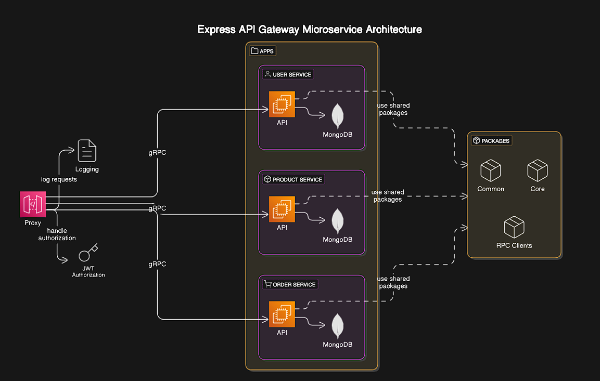

---

### **Overview**
`Express API Gateway` is a microservices-based system with an API Gateway using **gRPC** for inter-service communication. Built with a **monorepo architecture** managed by [**Turborepo**](https://turbo.build/).

---

## **What's Inside?**

This Turborepo includes the following:

### **Apps and Packages**

- **`proxy`**: An [Express.js](https://expressjs.com/) API Gateway for routing and communication.
- **`user`**: Manages user-related operations using MongoDB.
- **`product`**: Handles product management and inventory with MongoDB.
- **`order`**: Processes orders and tracks status using MongoDB.
- **`@app/common`**: Shared utilities and constants.
- **`@app/core`**: Core functionalities and shared helpers.
- **`@app/clients`**: gRPC clients for inter-service communication.

Each package/app is written in **[TypeScript](https://www.typescriptlang.org/)** for strong type safety and consistency.

---

## **Docker**

This repo is configured to work with Docker and Docker Compose. To build and run all apps:

1. **Install dependencies**:
   ```bash
   npm install
   ```

2. **Start all services in detached mode**:
   ```bash
   docker compose -f docker-compose.yml up -d
   ```

   Open [http://localhost:3000](http://localhost:8080) to access the gateway.

3. **Shutdown all running containers**:
   ```bash
   docker kill $(docker ps -q) && docker rm $(docker ps -a -q)
   ```
---

## **Setup**

1. **Clone and install dependencies**:
   ```bash
   git clone https://github.com/rahiii-dev/express-api-gateway
   cd express-api-gateway
   npm install
   ```

2. **Run individual services**:
   ```bash
   cd apps/{service-name}
   npm run dev
   ```

3. **Start the gateway**:
   ```bash
   cd apps/proxy
   npm run dev
   ```

4. **Run everything with Turborepo**[FROM ROOT]:
   ```bash
   npm run dev
   ```

---

## **Tech Stack**
- **Backend**: Node.js, Express.js, gRPC
- **Database**: MongoDB
- **Monorepo**: Turborepo

---

## **License**
Licensed under the MIT License.
